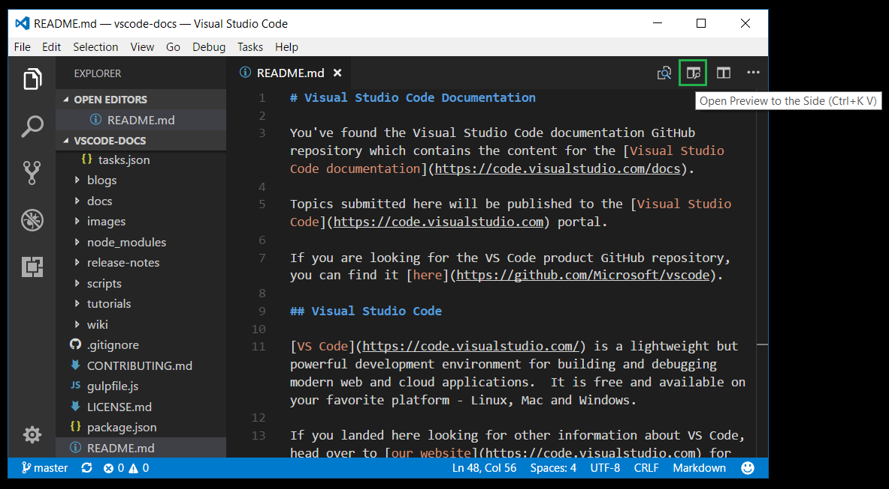

# Visual Studio Code

你可以在Visual Studio Code帮助文档的Github仓库中找到所有[Visual Studio Code帮助文档](https://code.visualstudio.com/docs)的内容。

在这里提交的话题会发布在[Visual Studio Code](https://code.visualstudio.com)的门户网站上。

如果你正在寻找VS Code软件的GitHub仓库，你可以从这找到 [https://github.com/Microsoft/vscode](https://github.com/Microsoft/vscode)。

## Visual Studio Code

[VS Code](https://code.visualstudio.com/)是一款轻量而又强大的用于构建和调试现代web应用和云应用的开发环境。它是免费而又支持Linux、Mac和Windows多平台的。

如果你想获取其他关于VS Code的信息，可以去[官网](https://code.visualstudio.com)获得额外的信息。

## 贡献

创建了新的话题/信息，或者对原有的文档做了更新，可以参考[贡献](https://github.com/Microsoft/vscode-docs/blob/master/CONTRIBUTING.md)。

## 反馈

如果你想给帮助文档做反馈，请在每篇文档下面的反馈栏中执行。

## 话题

为了防止文档的漏洞，如果没有你想要的话题，请新建一个[GitHub issue](https://github.com/Microsoft/vscode-docs/issues)。

如果你的话题是关于VS Code软件本身的，请进入[issues](https://github.com/Microsoft/vscode/issues)。

## 编辑

如果你想要编辑VS Code帮助文档，请确保你安装了[Git](https://git-scm.com/downloads)。

克隆仓库：

```
git clone https://github.com/Microsoft/vscode-docs.git
```

VS Code本身对[Markdown](https://code.visualstudio.com/docs/languages/markdown)有着很好的支持，不管是预览还是编辑。

如果你想使用VS Code简单的浏览`vscode-docs`文件目录，你可以这样来启动VS Code：

```
cd vscode-docs
code .
```

你可以打开任何Markdown文件，通过点击编辑器右上角的**打开侧边预览**来预览。




**翻译：** 艾江南